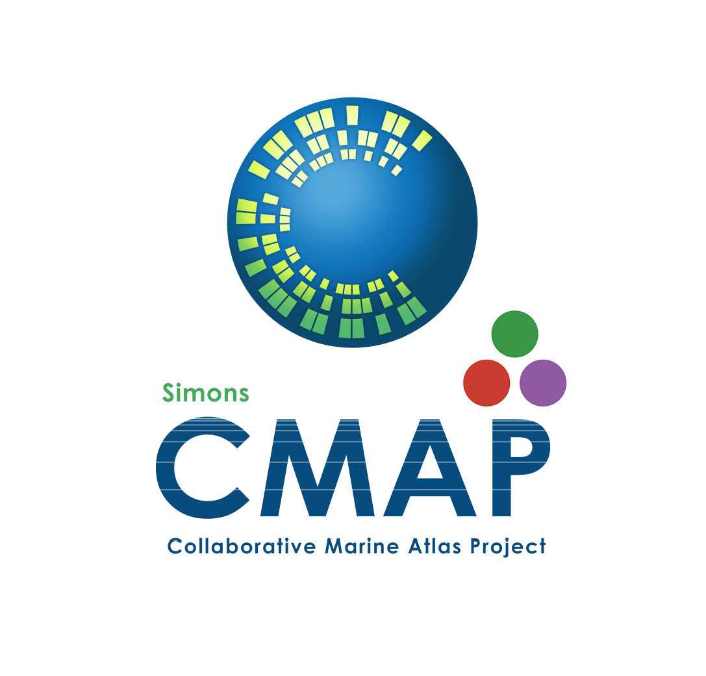

# cmap.jl

cmap.jl is the Julia client for Simons CMAP project. It provides access to the Simons CMAP database where various ocean data sets are hosted. These data sets include multi decades of remote sensing observations (satellite), numerical model estimates, and field expeditions.

This package is adopted from [pycmap](https://github.com/simonscmap/pycmap) which is the python client of Simons CMAP ecosystem. 

## Usage
To make API requests, you need to get an API key from [Simons CMAP website](https://simonscmap.com). Once you got your API key run the following command to store the API key on your local machine:

```
set_api_key("your api key");
```

## Documentation
To be filled out.

## Example:
1. Get the list of data sets:

```
datasets()
```

2. Retrieve a subset of sea surface temperature measured by satellite. 
 
 ```
space_time(
           table="tblArgoMerge_REP", 
           variable="argo_merge_salinity_adj", 
           dt1="2015-05-01", 
           dt2="2015-05-30", 
           lat1=28.1, 
           lat2=35.4, 
           lon1=-71.3, 
           lon2=-50, 
           depth1=0, 
           depth2=100
           )
```

